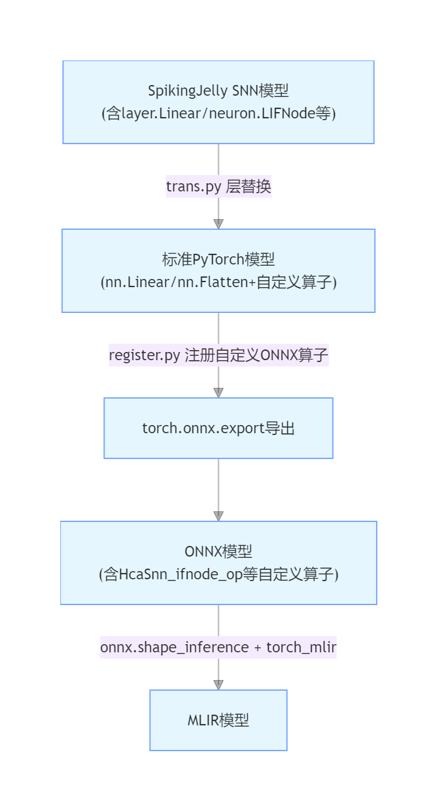

# spiking_mlir

A tool that trans spikingjelly module into FastHCA supported onnx mlir. Which can be trans via FastHCA into vitis HLS and be deployed on FPGA.

## install (python=3.11 , or you can build the source yourself)
pip install spiking_mlir/dist/spiking_mlir-0.1.0-py3-none-any.whl

