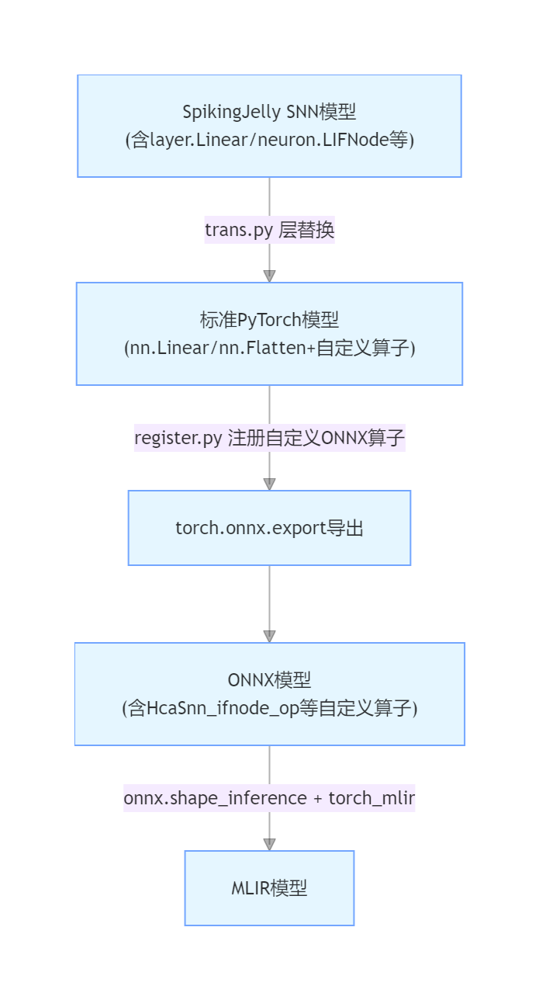

# spiking_mlir

A tool that trans spikingjelly module into FastHCA supported onnx mlir. Which can be trans via FastHCA into vitis HLS and be deployed on FPGA.

pip wheel . --wheel-dir dist --no-deps --no-build-isolation

